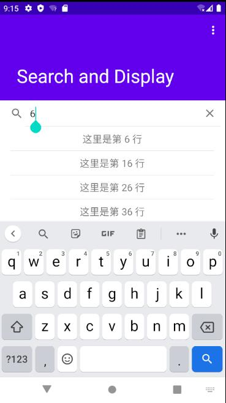

# Search and Display APP

> 详细说明和开发经验见我的博客[Kotlin安卓开发入门-使用SearchView和RecyclerView实现搜索和展示](https://www.cnblogs.com/smileglaze/p/14470624.html)

* 使用`kotlin`编写
* 主要有那些功能？
	* 展示一个100条内容的`recyclerview`
	* 通过`searchview`输入关键词，改变`recyclerview`显示列表
	* 点击列表项会跳转到新的展示`Activity`用于展示其中的内容
	

By [Yiwei Yang](https://github.com/Smileglaze).
