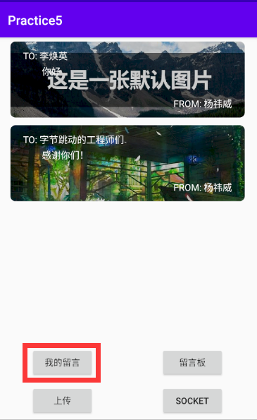

# Chapter5 网络请求与消息传输

* 使用`Java`编写
* 主要有那些功能？
	* 1：通过`HttpUrlConnection`的⽅式拉取留⾔列表
	* 2：通过`Retrofit`的⽅式实现提交留⾔
	* 3：通过`HttpUrlConnection`⽅式实现留⾔提交
	* 4：⽤Socket的⽅式实现简单Head请求
	* 5：上传页预置默认封面图
* [接口参考](https://github.com/Smileglaze/bytedance-android-camp/blob/main/chapter5/files/About%20Interface.pdf)

效果图

写入body格式参考

By [Yiwei Yang](https://github.com/Smileglaze).
